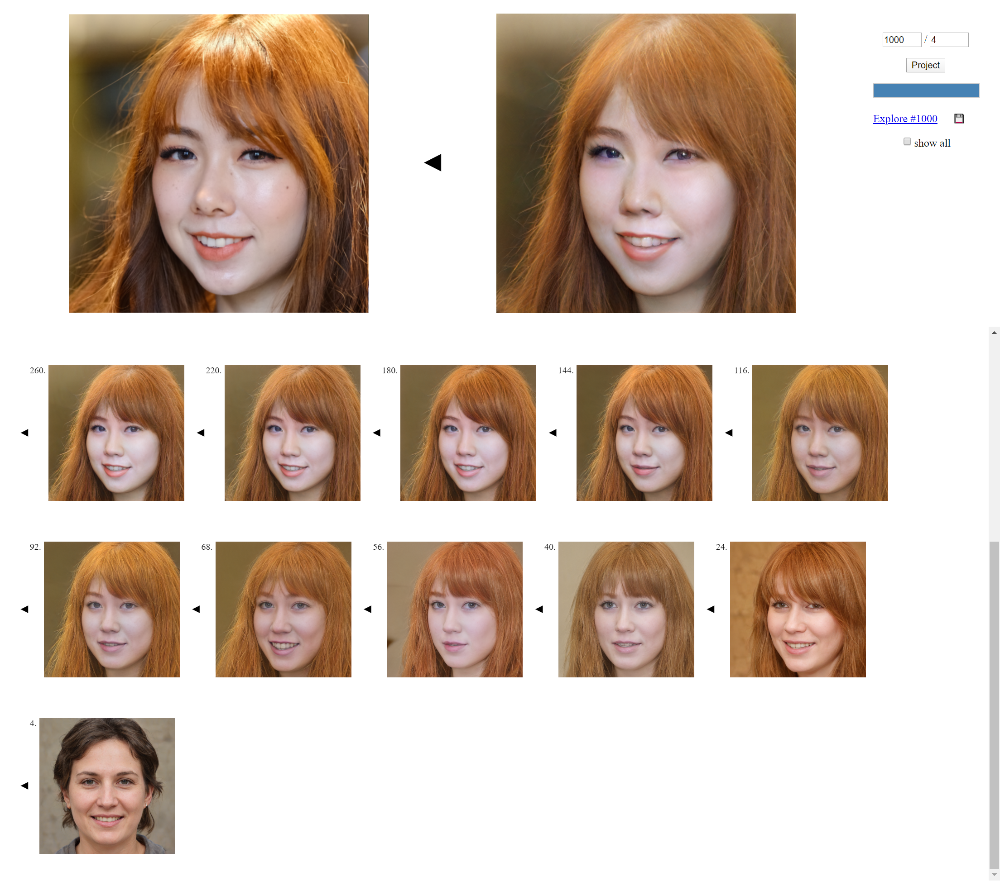
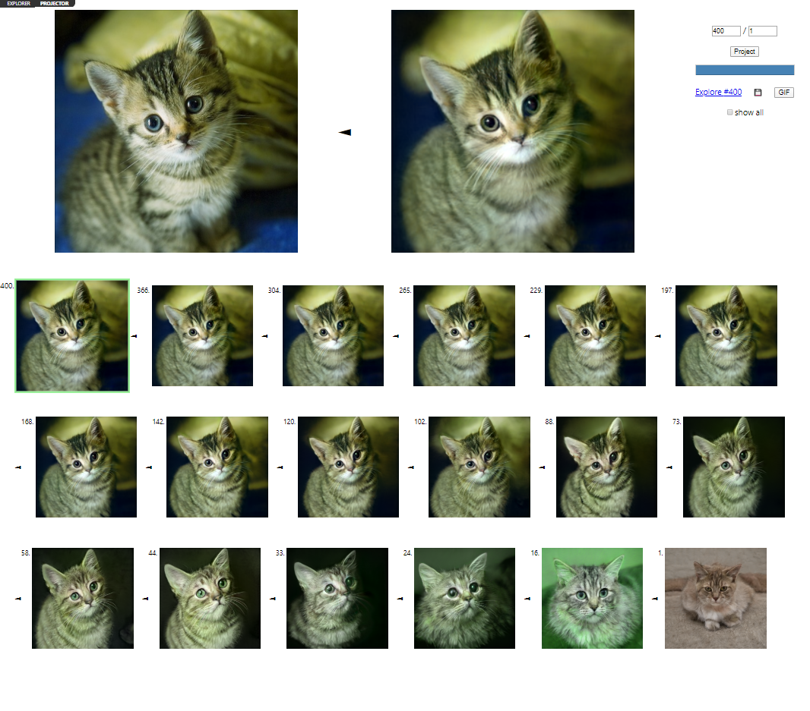

[](https://www.youtube.com/watch?v=ek1j272iAmc)

This project is a web porting for [NVlabs' StyleGAN2](https://github.com/NVlabs/stylegan2), to facilitate exploring all kinds characteristic of StyleGAN networks.

Thanks for [NVlabs](https://github.com/NVlabs)' excellent work.

## Functionality

### Projector




## Run Web Server

```.bash
python ./http_server.py
```

To ensure it working, please read the following requirements before do this.

## Requirements

### Python

Install requirement libraries with pip, reference to [requirements.txt](./requirements.txt).

### Network Files

Before run the web server, StyleGAN2 pre-trained network files must be placed in local disk (recommended the folder `models`). You can download network files following to [StyleGAN2's code](https://github.com/NVlabs/stylegan2/blob/master/pretrained_networks.py).

For memory reason, only one generator model can be loaded when running the web server. Network file paths can be configured by env variables. Create a file named `.env.local` under project root to configure chosen model and network file paths. Network file name/paths are configured in key-value style, e.g.:

<a name="model-paths-example"></a>
```.env
MODEL_NAME=ffhq		# ffhq is the default value, so this line can be ignored 

MODEL_PATH_ffhq=./models/stylegan2-ffhq-config-f.pkl
MODEL_PATH_cat=./models/stylegan2-cat-config-f.pkl
# And so on...
```

Alternately, you can also choose generator model name by start command argument, e.g.:

```.bash
python ./http_server.py cat
```

Or, for nodejs developer:

```.bash
yarn start cat
```

Besides generators, the network *LPIPS* is required when run image projector, the default local path is `./models/vgg16_zhang_perceptual.pkl`, [download link](https://drive.google.com/uc?id=1N2-m9qszOeVC9Tq77WxsLnuWwOedQiD2). You can also change local path by env variable `MODEL_PATH_LPIPS`.

### For Windows

According to [StyleGAN2 README.md](https://github.com/NVlabs/stylegan2#requirements), here are our additional help instructions:

* MSVC

	**NOTE**: Visual Studio 2019 Community Edition seems not compatible with CUDA 10.0, Visual Studio 2017 works.

	Append the actual msvc binary directory (find in your own disk) into `dnnlib/tflib/custom_ops.py`, the array of `compiler_bindir_search_path`. For example:

	```patch
	-	'C:/Program Files (x86)/Microsoft Visual Studio 14.0/vc/bin',
	+	'C:/Program Files (x86)/Microsoft Visual Studio/2017/BuildTools/VC/Tools/MSVC/14.16.27023/bin/Hostx64/x64',
	```

* NVCC

	To test if nvcc is configured properly, dowload [test_nvcc.cu](https://github.com/NVlabs/stylegan2/blob/master/test_nvcc.cu) in StyleGAN2 project. And the test command should specify binary path:

	```.bash
	nvcc test_nvcc.cu -o test_nvcc -run -ccbin "C:\Program Files (x86)\Microsoft VisualStudio\2017\BuildTools\VC\Tools\MSVC\14.16.27023\bin\Hostx64\x64"
	```

	Actual path to different msvc edition may have difference in detail. If this succeed, it will build a file named `test_nvcc.exe`.

* Tips for tensorflow 1.15

	Tensorflow 1.15 can work under Windows, but *NVCC* compiling may encounter C++ including path issue. This is an easy workaround: make a symbolic link in python installation directory `Python36\Lib\site-packages\tensorflow_core`:

	```.bash
	mklink /J tensorflow tensorflow_core
	```

## Environment Configurations

To manage environment variables easily, create a configuration file named `.env.local`. Avaiable env list:

Key							| Description							| Default Value
:--							| :--									| :--
**HTTP_HOST**				| Web server host.						| *127.0.0.1*
**HTTP_PORT**				| Web server port.						| *8186*
**MODEL_NAME**				| Name for the generator model to load, this can be overwrite by the first argument of *[start script](./package.json#L7)*.	| *ffhq*
**MODEL_PATH_LPIPS**		| File path for LPIPS model.			| *./models/vgg16_zhang_perceptual.pkl*
**MODEL_PATH_***			| Generator network file path dictionary. See [examples](#model-paths-example).	|
**REGULARIZE_NOISE_WEIGHT**	| Projector training hyperparameter.	| *1e5*
**LPIPS_IMAGE_SHAPE**			| LPIPS image input shape.				| *256,256*
